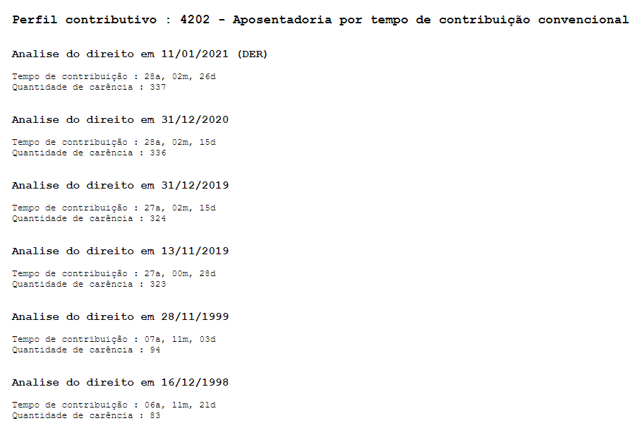

# Extrato de Tempo de Contribuição e Carência

## O que é?

Esse programa tem como objeto extrair, do documento de "Análise do Direito" emitido pelo INSS, o tempo de contribuição e a carência em todas as datas relevantes (Alterações legislativas e na DER).

Em suma, o programa converte isso:

Em algo mais legível e organizado:

Para PDFs com texto codificado ou que foram criados a partir de imagens/digitalizações, é feita a conversão do PDF em imagens individuais, para então extrair as informações das imagens. Isso é feito de forma automatizada, sem intervenção do usuário, mas o processo pode demorar alguns segundos. Nesses casos, é recomendável carregar no programa o PDF apenas com as páginas da Análise do Direito, e não o Processo Admnistrativo Previdenciário por completo, pois, a depender do computador do usuário, poderá haver inconsistências ou erros no programa.

## Indo além: importando no Tramitação Inteligente

Essa informação organizada pode ser utilizada com a [Extensão PTI-TC-Carência](https://github.com/joaotextor/pti-tc-carencia) para importar, de forma automática e de uma só vez, o tempo de contribuição e carência dentro da Planilha do [Tramitação Inteligente](https://planilha.tramitacaointeligente.com.br/).

Para saber mais sobre essa funcionalidade, acesse a [Extensão PTI-TC-Carência](https://github.com/joaotextor/pti-tc-carencia).
